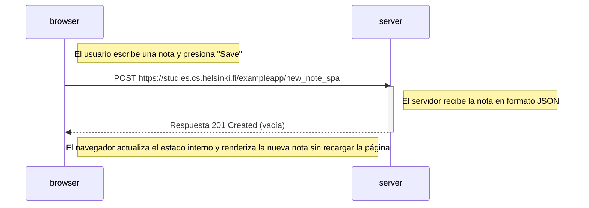

```mermaid
sequenceDiagram
    participant browser
    participant server

    Note right of browser: El usuario escribe una nota y presiona "Save"

    browser->>server: POST https://studies.cs.helsinki.fi/exampleapp/new_note_spa
    activate server
    Note right of server: El servidor recibe la nota en formato JSON
    server-->>browser: Respuesta 201 Created (vacía)
    deactivate server

    Note right of browser: El navegador actualiza el estado interno y renderiza la nueva nota sin recargar la página
```
